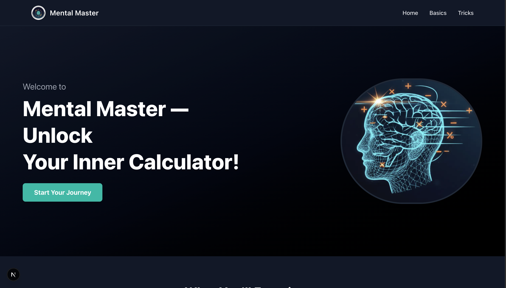
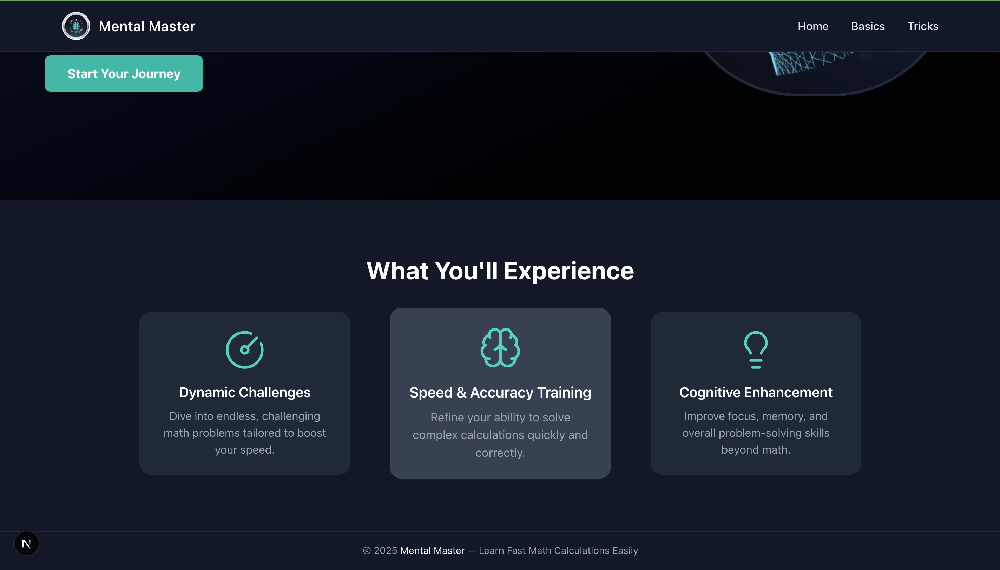
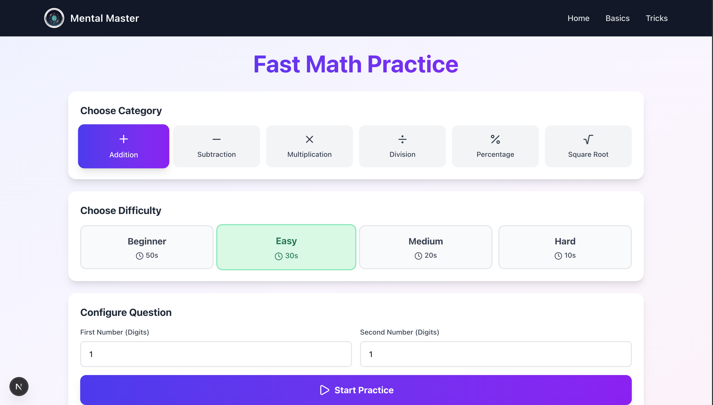
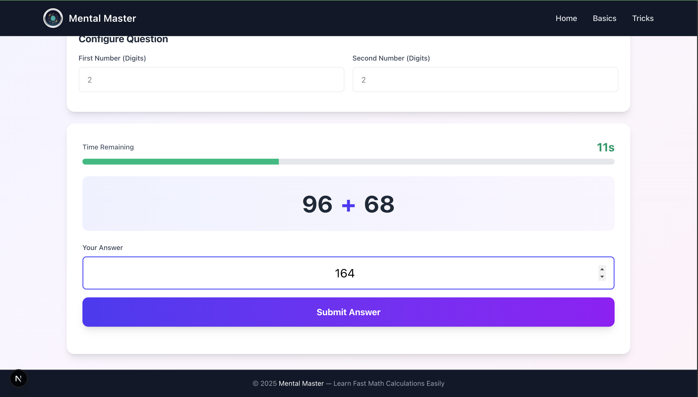
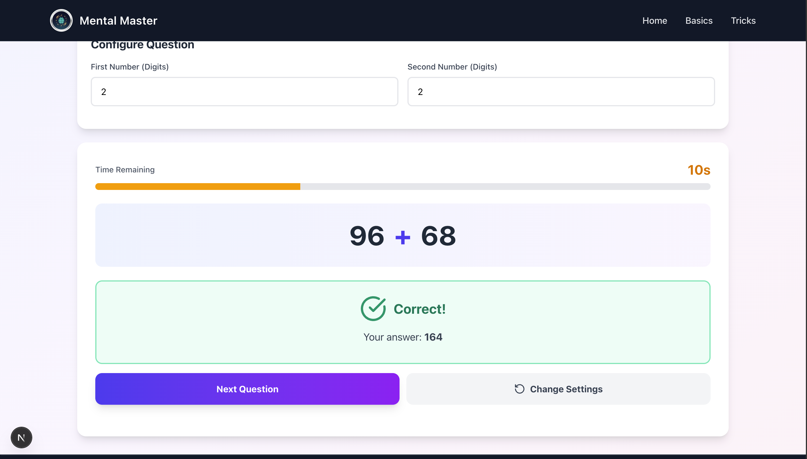
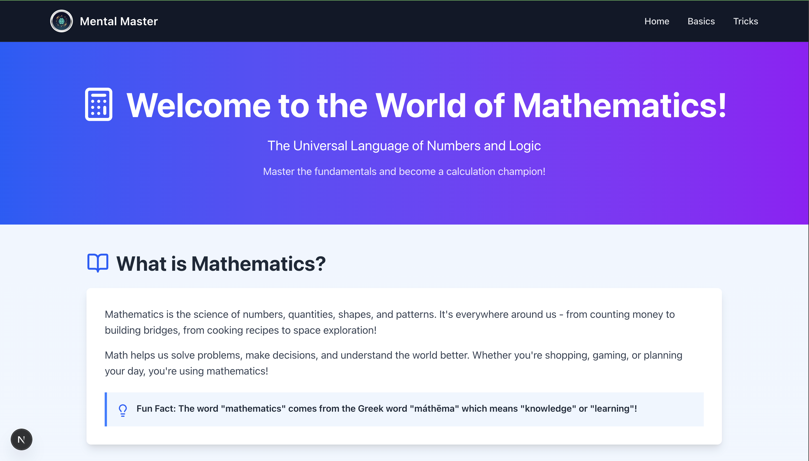

# Mental Master: Unlock Your Inner Calculator

Mental Master is a web application designed to help users master mental math and fast calculation techniques. It features a practice module with configurable difficulty and category, as well as a dedicated section to learn powerful Vedic mathematics tricks.

<p align="center">
  
</p>

---

## Key Features

- **Fast Math Practice:** Engage in timed practice sessions across various categories, including **Addition**, **Subtraction**, **Multiplication**, **Division**, **Percentage**, and **Square Root**.
- **Configurable Difficulty:** Choose from **Beginner (50s)**, **Easy (30s)**, **Medium (20s)**, and **Hard (10s)** to adjust the time limit per question.
- **Question Configuration:** Customize the number of digits for the operands in non-square root categories, and select between **Perfect** or **Any** type of square root questions.
- **Math Tricks:** Explore a curated collection of mathematics techniques
- **Progress Tracking:** Monitor your performance with a live **Score** tracker displaying correct answers versus total attempts.

---

## Tech Stack and Dependencies

This project is built using **Next.js** with **React** and styled with **Tailwind CSS**. **MongoDB** is used as the database for storing the Vedic Math tricks.

### Core Technologies

| Technology             | Role                |
| :--------------------- | :------------------ |
| **Next.js (React)**    | Front-end Framework |
| **Tailwind CSS**       | Styling             |
| **MongoDB (Mongoose)** | Database and ODM    |

### Dependencies

| Package          | Purpose                            |
| :--------------- | :--------------------------------- |
| `npm@11.6.2`     | Package manager                    |
| `lucide-react`   | Icon library                       |
| `react-toastify` | Notifications/Toasts               |
| `tailwindcss`    | Utility-first CSS framework        |
| `mongoose`       | MongoDB object data modeling (ODM) |

---

## Folder Structure

```
mental-master-app/
├── public/
│   ├── logo.png             // Application logo
│   └── brain-illustration.png
├── src/
│   ├── app/
│   │   ├── api/             // API routes for data fetching (getTricks)
│   │   │   └── getTricks/
│   │   │       └── route.js
│   │   ├── layout.js
│   │   ├── page.js          // Home Page
│   │   ├── home/
│   │   │   └── page.js      // MathPracticeApp component
│   │   ├── basics/
│   │   │   └── page.js      // Basics of math component
│   │   └── tricks/
│   │       └── page.js      // MathsTricks component
│   ├── components/          // Reusable UI components
│   └── models/
│   │   └── mathTrick.js     // Mongoose model for tricks
│   └── lib/
│       └── db.js            // Database connection utility
└── README.md
```

---

## Getting Started

### 1. Prerequisites

- Node.js (Ensure compatibility with your Next.js version)
- Access to a MongoDB instance (local or Atlas)

### 2. Installation

1.  Clone the repository:

    ```bash
    git clone [repository-url]
    cd mental-master
    ```

2.  Install the required dependencies:

    ```bash
    npm install
    ```

3.  Set the specified global package manager version:
    ```bash
    npm install -g npm@11.6.2
    ```

### 3. Environment Variables

Create a `.env.local` file in the root directory and add your MongoDB connection string:

- .env
  - MONGODB_URI="<YOUR_MONGO_DB_CONNECTION_STRING>"
  - DB_NAME=<YOUR_DTATBASE_NAME>

---

## Screenshots

The following images showcase the main user interfaces of the application:

### Landing Page



<br>



<br>
<br>

### Home Page



<br>



<br>



<br>

### Basics page



<br>

### Tricks page


<br>
